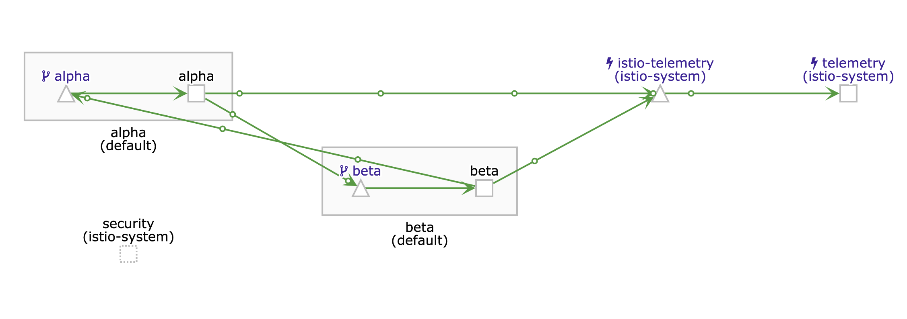

# istio-microservice-example

This repo provides a `kubectl apply -f kubernetes/` example to show two ping/pong
services within istio.

This is aimed at someone who has istio installed but wants to generate real traffic.

