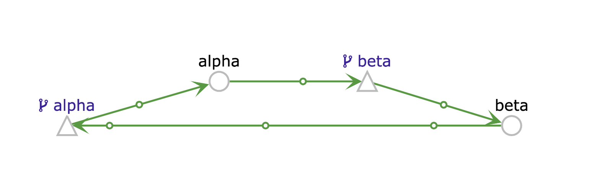

# istio-microservice-example

This repo provides a `kubectl apply -f kubernetes/` example to show two ping/pong
services within istio.

This is aimed at someone who has istio installed but wants to generate real traffic.


## Overview of code

A single file that does both server/client ping/pong via `protocolbuffers/message` type

The magic that makes istio work is `kubernetes/*/istio-virtualservice`

What does the code actually do? 
```
beta-589cc99f45-s2l5d beta time="2019-06-21T09:26:37Z" level=info msg="Response: Pong number 389"
beta-589cc99f45-s2l5d beta time="2019-06-21T09:26:37Z" level=info msg="Sending ping:400"
beta-589cc99f45-s2l5d beta time="2019-06-21T09:26:38Z" level=info msg="Response: Pong number 390"
beta-589cc99f45-s2l5d beta time="2019-06-21T09:26:38Z" level=info msg="Sending ping:401"
beta-589cc99f45-s2l5d beta time="2019-06-21T09:26:39Z" level=info msg="Response: Pong number 391"
beta-589cc99f45-s2l5d beta time="2019-06-21T09:26:39Z" level=info msg="Sending ping:402"
beta-589cc99f45-s2l5d beta time="2019-06-21T09:26:40Z" level=info msg="Response: Pong number 392"
beta-589cc99f45-s2l5d beta time="2019-06-21T09:26:40Z" level=info msg="Sending ping:403"
beta-589cc99f45-s2l5d beta time="2019-06-21T09:26:41Z" level=info msg="Response: Pong number 393"
```
